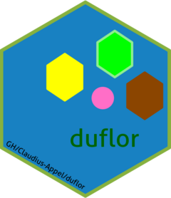

<!-- README.md is generated from README.Rmd. Please edit that file -->

# duflor <a href="https://github.com/Claudius-Appel/duflor/"></a>

<!-- badges: start -->

[](https://github.com/Claudius-Appel/duflor/actions/workflows/R-CMD-check.yaml)
[](https://github.com/Claudius-Appel/duflor/actions/workflows/R-CMD-check.yaml)
<!-- badges: end -->

## Overview

Duflor is a package to detect and quantify number of pixels in any
subrange(s) of HSV-color space declared by an upper and lower bound.
While the package is principally task-agnostic and could work on any
sort of HSV-range(s), it is developed for the detection and
quantification of plant area.

## Installation

You can install the development and release versions of `duflor` like
so:

``` r
# release
devtools::install_github("https://github.com/Claudius-Appel/duflor@master")
# development
devtools::install_github("https://github.com/Claudius-Appel/duflor@dev")
```

If help-vignettes are to be downloaded, use instead:

``` r
devtools::install_github("https://github.com/Claudius-Appel/duflor@master"
  ,build_vignettes = T)
devtools::install_github("https://github.com/Claudius-Appel/duflor@dev"
  ,build_vignettes = T)
```

Vignettes are rendered documents discussing specific topics within a
package. Installing them is recommended, but not required for utilising
the package itself.

### Prerequisites

Installing this package from GitHub requires the installation of the
R-package `devtools`:

``` r
install.packages("devtools")
```

### Dependencies

The function \[load_all()\] can optionally load subsets of an image; for
more information see its documentation. To allow this to work, the
package [RBioFormats](https://github.com/aoles/RBioFormats) is required.
Refer to its documentation for installing the package.

## Usage

For detailed documentation, refer to
<https://claudius-appel.github.io/duflor/>

### Vignettes

Upon loading, duflor will set the following options via `options(XX)`:

- duflor.default_hsv_spectrums: default HSV-ranges for
  - drought leaf-area
  - green leaf-area
  - complete leaf-area
  - identifier area
- duflor.default_identifier_area: the size of the `identifier_dot` in
  \[cm^2\].

Their values can be retrieved via `getOption(option)`.

``` r
getOption("duflor.default_hsv_spectrums")
getOption("duflor.default_identifier_area")
```

`duflor.default_hsv_spectrums` is merely used as a shortcut to load the
currently-set default hsv ranges. It is not intended to be modified; as
it serves no internal use. `duflor.default_identifier_area` is more
likely to require modification. Before calculating the area for each
spectrum via `duflor::pixels_to_area(pixel.counts)`, the true area of
the identifier-dot must be set via this option. The default is set to
0.503. All areas are assumed to be in \[cm^2\].

## Further
